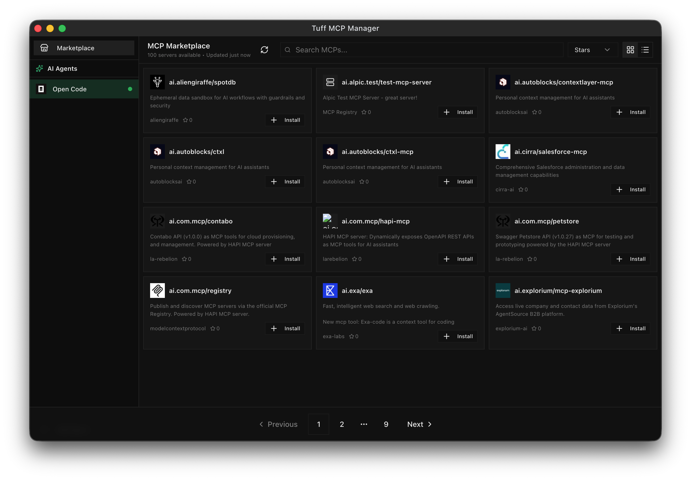

# Tuff MCP Manager

Multi-agent MCP server manager.


### MCP Marketplace

1-click MCP server installation into your local agents (Claude, Cursor, and more).



## Build

```bash
npm install
npm run make
```

## Development

```bash
npm install
npm start
```

## Release

To cut a new GitHub release:

```bash
./release.sh
```

This will prompt you to select a version bump (patch/minor/major/custom), update `package.json`, commit, tag, and push. GitHub Actions will then build and publish the release artifacts.

## License

MIT - Based on [mcp-gearbox](https://github.com/rohitsoni007/mcp-gearbox)
