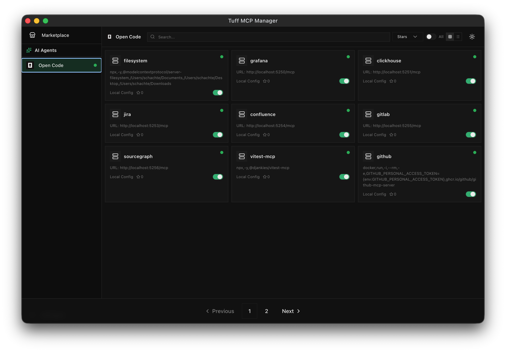

# Tuff MCP Manager

Multi-agent MCP server manager.



## Build

```bash
npm install
npm run make
```

## Development

```bash
npm install
npm start
```

## License

MIT - Based on [tuff-mcp-manager](https://github.com/rohitsoni007/tuff-mcp-manager)
